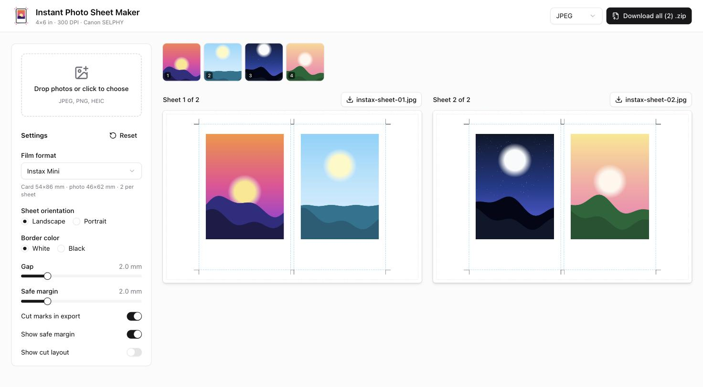

<p align="center">
  
</p>

<h1 align="center">Instant Photo Sheet Maker</h1>

<p align="center">
  Print your photos as Instax and Polaroid-style prints on 4×6 postcard paper, then cut them out.
</p>

<p align="center">
  <a href="https://photosheet.seanyasno.com"><strong>photosheet.seanyasno.com</strong></a>
</p>

<p align="center">
  
</p>

## What it does

You drop in photos. The app lays them out as instant-film prints on a 4×6 in (152.4 × 101.6 mm) sheet, sized for a
**Canon SELPHY** (CP1500 or similar) postcard printer. You export the sheets at **300 DPI** (1800 × 1200 px), print
them at 100%, and cut along the marks. The result is prints at the real film size, with the classic thick bottom border.

Everything runs in your browser. Photos are decoded, cropped and rendered locally with the Canvas API, and nothing is
uploaded anywhere.

## Features

- **Six film formats**: Instax Mini, Square, Wide (horizontal and vertical), Polaroid Go, and Polaroid (i-Type / 600).
- **Automatic layout**: the app works out how many prints fit on a sheet and turns cards 90° when that fits more.
  A turned card carries its photo with it, so every print comes out upright once cut.
- **Auto-fill sheets**: photos fill the slots in order, and extra sheets are added as needed.
- **Crop editor**: click any print to pan, zoom and rotate the photo. The crop is locked to the film's aspect ratio.
- **Live preview**: the preview uses the same renderer as the export, so what you see is what prints.
- **Cut marks**: thin crop marks go in the gutters and margins and never touch a photo.
- **Cut layout view**: numbered, full-length guillotine cuts, each with its distance from the sheet edge. It pairs well
  with a paper trimmer.
- **Export**: JPEG (quality 0.95) or PNG, per sheet or all sheets as a `.zip`.
- **Settings**: film format, sheet orientation, white or black border, gap, safe margin, cut marks, and a reset
  button that keeps your photos.
- **HEIC support**: iPhone photos work. The decoder is loaded only when you drop a HEIC file.

## Film formats

| Format | Card (mm) | Photo (mm) | Per 4×6 sheet |
| --- | --- | --- | --- |
| Instax Mini | 54 × 86 | 46 × 62 | 2 |
| Instax Square | 72 × 86 | 62 × 62 | 2 |
| Instax Wide (Horizontal) | 108 × 86 | 99 × 62 | 1 |
| Instax Wide (Vertical) | 86 × 108 | 62 × 99 | 1 |
| Polaroid Go | 53.9 × 66.6 | 47 × 46 | 2 |
| Polaroid (i-Type / 600) | 88 × 107 | 79 × 79 | 1 |

The counts assume the default 2 mm gap and 2 mm safe margin. The layout engine computes them; they aren't
hardcoded. All physical sizes live in [`src/config/dimensions.ts`](src/config/dimensions.ts). If your film's borders
measure differently, tweak them there.

## Getting started

Requirements: Node 20+ and [pnpm](https://pnpm.io).

```bash
pnpm install
pnpm dev        # http://localhost:3000
```

| Command | What it does |
| --- | --- |
| `pnpm dev` | Start the dev server |
| `pnpm build` | Production build: prerendered static site in `dist/client` |
| `pnpm test` | Unit tests (Vitest) |
| `pnpm typecheck` | TypeScript, strict mode |
| `pnpm lint` | ESLint |
| `pnpm format` | Prettier and ESLint fixes |

## Printing tips

1. Export the sheets and print them **at 100% / actual size** on 4×6 postcard paper.
2. The exported file is exact: 1 mm = 11.81 px at 300 DPI, so an Instax Mini card is 638 × 1016 px. SELPHY
   borderless printing enlarges the image slightly so it bleeds off the paper edge, which is why the app keeps
   everything inside a configurable **safe margin**. Measure your first print against the cut marks.
3. Turn on **Show cut layout** and follow the numbered cuts. Make every vertical cut first, edge to edge, then the
   horizontal cuts on each strip.

## How it works

```
src/
  config/dimensions.ts   Physical sizes: sheet, film formats, DPI (single source of truth)
  lib/
    layout.ts            computeLayout(): best grid for a card size, incl. 90° rotation
    card.ts              Photo window position inside a (possibly turned) card
    cutMarks.ts          Cut-mark segments and the guillotine cut plan
    crop.ts              Cover-fit default crop and rotation math
    geometry.ts          Settings → sheet geometry, all in mm
    render.ts            renderSheet(): the one renderer for preview AND export
    export.ts            300 DPI OffscreenCanvas → JPEG/PNG, zip
    loadImage.ts         File → ImageBitmap (EXIF-aware, HEIC on demand, size-capped)
  state/                 Pure reducer (photos + settings)
  components/            Upload, photo strip, sheet preview, crop dialog, settings
  routes/index.tsx       The app page (client-only)
```

All geometry is computed in millimetres by pure, unit-tested functions. Pixels only appear at render time
(`px = mm / 25.4 × dpi`). The preview and the export call the same `renderSheet` function and differ only in scale
and in a few screen-only overlays, such as the safe-margin outline and the cut layout.

## Deployment

`pnpm build` prerenders the page to static HTML in `dist/client` (plus `robots.txt`, `sitemap.xml`, `llms.txt`
and icons from `public/`), so any static host works. The live site runs on **Cloudflare Pages**, connected to this
repo, with build command `pnpm build` and output directory `dist/client`.

## Tech stack

[TanStack Start](https://tanstack.com/start) (React) · TypeScript (strict) · [shadcn/ui](https://ui.shadcn.com) and
Tailwind CSS · [react-easy-crop](https://github.com/ValentinH/react-easy-crop) · [dnd-kit](https://dndkit.com) ·
[fflate](https://github.com/101arrowz/fflate) · [heic-to](https://github.com/hoppergee/heic-to) · Vitest
